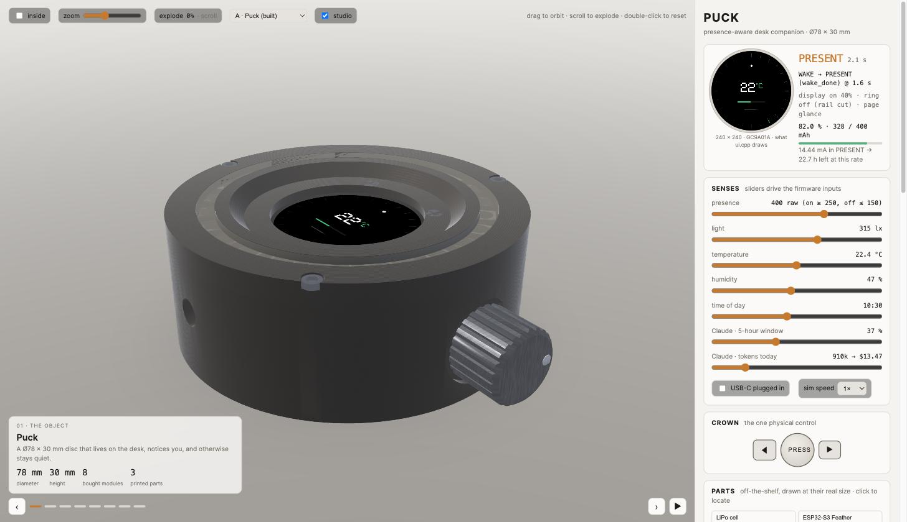
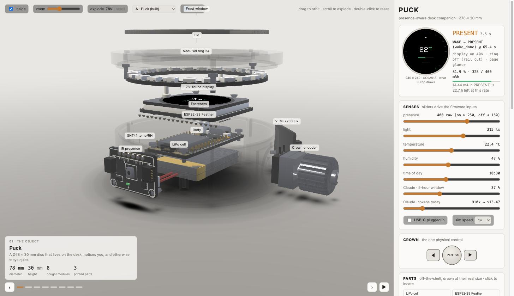
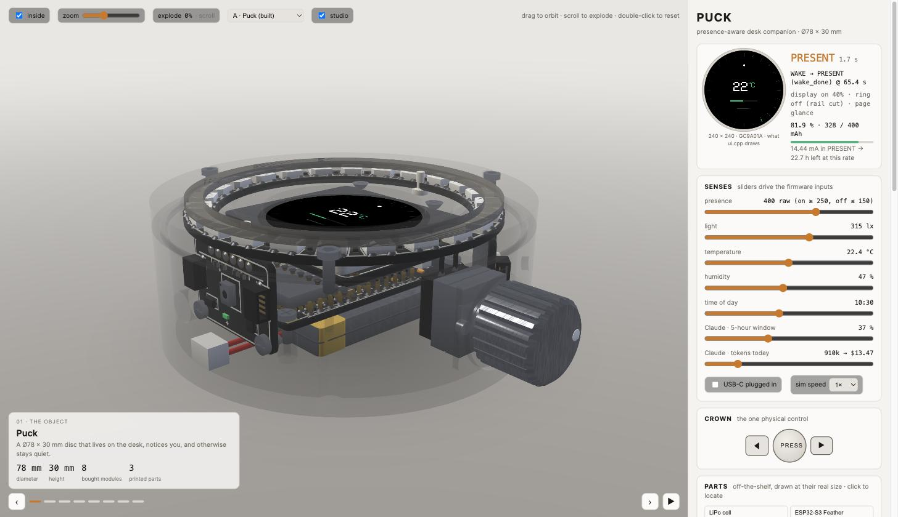
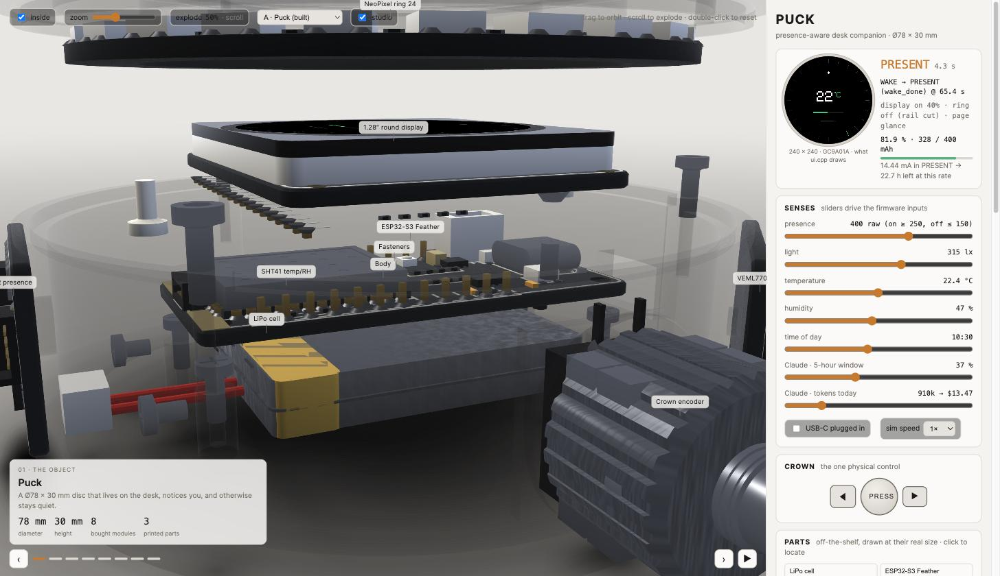
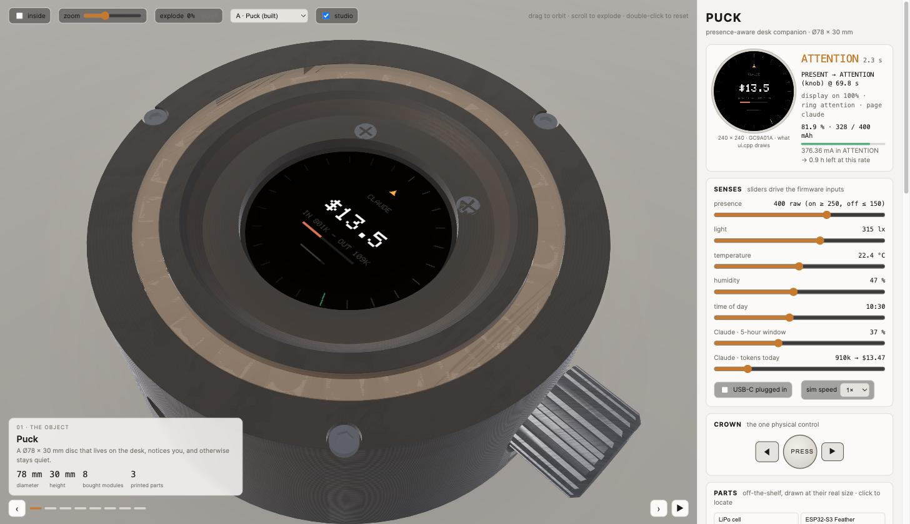
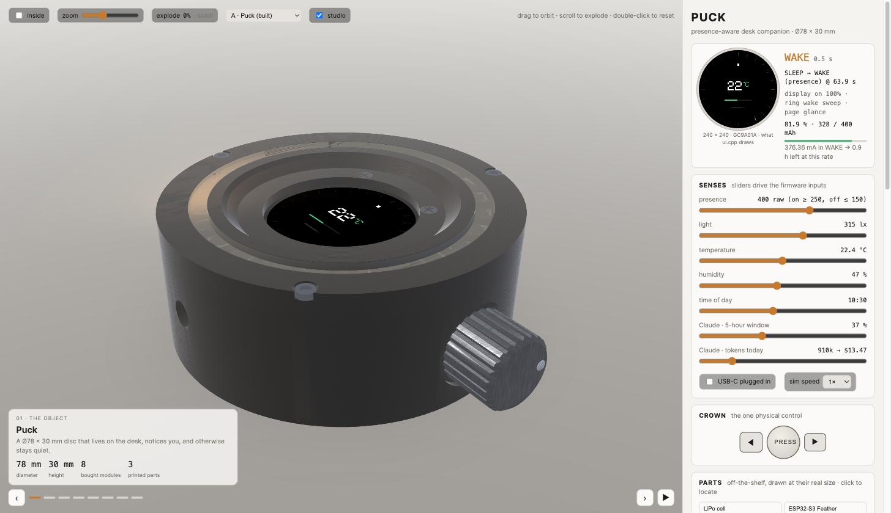

# Vibe Hardware — describe the intent, get the device

<p align="center">
  
</p>

**The method has a name, and the first thing it made has a name.** The method is **vibe hardware**.
The object is **Puck**.

## The pitch

Vibe coding gave us "describe the app, get the app." Vibe hardware is the same move on physical things:
**describe what the object should *do*, and get the object** — surveyed, specified, priced, modelled,
firmware'd, and *running on your screen* before a single part is ordered.

You don't hand the model a spec. You hand it an intent: *"something that lives on my desk, notices me, tells me
one thing worth knowing, and otherwise stays quiet."* The model decides the rest — **what** it should be,
**how** it should work, and crucially **what it is made from** — then builds it and lets you hold it,
virtually, from every angle.

## The loop

**Intent → survey → concepts → BOM → geometry → firmware → live emulation.**

The model reads real supplier pages and datasheets *first*, because dimensions are the actual constraints — a
52.3 mm inner diameter decides a form far better than taste does. It proposes several forms, argues each from a
specific part dimension, and commits to one. It locks a shopping list with live links and tonight's prices. It
writes one parametric source of truth that emits both the printable STL **and** the mesh you see. It writes the
firmware. Then it ports that firmware into the browser and *runs it*.

> **`dist/companion.html` is not a 3D model of the device. It is the device.**
> The state machine in that page is the firmware's state machine. The display is drawn pixel-for-pixel by the
> ported `ui.cpp`. The battery drains at the current the datasheets say the real parts draw. Open it with the
> wifi off and it runs: one file, no libraries, no CDN, no assets.

## The hard constraint that makes it real

**Off-the-shelf modules and 3D-printed parts only.** No custom PCB, no tooling, no six-week lead time. Every
component is something a moderately experienced maker can hand-solder, and every plastic part comes off a
desktop printer. That single rule is what turns a beautiful simulation into a thing you can actually own: the
BOM is orderable tonight, the STL is printable tonight, and the gap between the preview and the object on your
desk is a weekend, not a product cycle.

## What it achieves

It collapses the most expensive part of hardware: **the distance between an idea and knowing whether it works.**
Normally you find out the battery can't last a day, or the LED ring doesn't clear the display, after you have
spent the money and two weeks. Here you find out in the browser — the fit check runs exact solid-geometry
booleans, the power table comes from datasheet currents, and the pin budget flags the I²C address collision
before it becomes a returned part.

And it refuses to bluff. The whole project ran under one rule: **nothing is allowed to be merely plausible.**
Every dimension, price, current draw and library version comes from a supplier page or a datasheet that was
actually opened, or it is explicitly marked `unverified`. A made-up number that looks right is worse than a hole.
So the simulation is not a mood board — when it says *22.7 hours left*, that number has a paper trail.

## Puck, the proof

Ø78 × 30 mm. Eight bought modules, three printed parts, ≈ AU$171 / US$95. A presence-aware desk object that
notices when you sit down, shows one thing worth knowing at a glance, glows quietly, and otherwise stays out of
the way: presence, light, temperature and humidity, one knurled crown, a round display, a ring of ambient light,
no tether. 141 detailed sub-parts you can explode with a scroll wheel, down to the bond wires inside the LEDs.
Designed, built and emulated in a single ~2-hour session, from a blank repo.

**Describe the intent. Get a device you can order, print, flash — and play with first.**

| | |
|---|---|
|  |  |
| **Scroll to explode.** Every part leaves along its own assembly axis, fasteners last, labelled as it goes. | **See inside.** The shell goes translucent and the real modules sit where they really sit. |
|  |  |
| **Real parts, not blocks.** Silkscreen, ENIG pads, solder fillets, castellations, gold headers, Phillips recesses. | **Live display + ambient ring.** Turn the crown to the Claude page; the ring lights, and the power budget reacts. |

---

## What is actually simulated

Most hardware "demos" are an animation of an idea. This one computes:

| Simulated | How |
|---|---|
| **State machine** | `firmware/state_machine.cpp` hand-ported line-for-line to `demo/src/state_machine.js` — same states (`SLEEP · WAKE · PRESENT · NIGHT · ATTENTION · AWAY_PENDING`), same transitions, same guards. The port boundary is marked in a comment banner in both files. |
| **Timing constants** | `build.py` parses every `#define` in `firmware/config.h` and emits them into the page as `FW.*`. Change `T_AWAY_MS` in the firmware and the browser's timeout changes with it. 90 constants cross that boundary. |
| **The display** | `ui.cpp` ported to JS, drawing through a tiny `Adafruit_GFX` shim (including the real 5×7 glcd font) into a 240×240 canvas — the panel's true resolution — which is then textured onto the glass in 3D. `Math.fround` is used where the C code narrows to `float`, so the browser and the MCU round identically. |
| **The LED ring** | `leds.cpp` ported; per-LED colour, brightness cap and animation phase, rendered as 24 emissive segments plus an additive halo through the frosted annulus. |
| **Power** | Per-part, per-mode currents from datasheets in `parts/parts.json` → totals per state → runtime on the chosen cell → the battery readout in the page, drained in real time as you change states. |
| **Fit** | Exact CSG booleans in `geometry/device.py` (not bounding boxes): every component against the internal volume with a 0.5 mm clearance rule. Failures turn red in the 3D view. |
| **Pins** | Every GPIO assigned from `parts.json`, with I²C address collisions flagged (the STHS34PF80 at `0x5A` collides with the DRV2605L haptic — which is why the no-limit tier costs a second board). |

Measured on the page as shipped:

| Mode | Current | Runtime on 400 mAh |
|---|---|---|
| `SLEEP` | 0.12 mA | ~141 days |
| `NIGHT` | 5.04 mA | ~79 h |
| `PRESENT` | 14.44 mA | ~27.7 h |
| `WAKE` / `ATTENTION` (ring lit) | 376.4 mA | ~1 h — event-only by design |

<p align="center">
  <br>
  <sub><b>SLEEP → WAKE (presence)</b> — the ring sweeps and the readout immediately drops to <b>376.36 mA → 0.9 h left</b>.
  Move the presence slider and the firmware's own transition fires; the cost of that animation is not decorative.</sub>
</p>

The page's own verdict: every continuous mode clears an 8-hour working day; the two ring-lit modes are *burst only*,
which is exactly how the firmware uses them. The ring is the entire power story — 312 mA of the 376 — which is why it
lives on the Feather's **switchable** STEMMA QT rail, is capped at 20 % brightness, and is cut completely in sleep.

---

## How it was designed (the order matters)

1. **Survey the parts first** → [`docs/01-survey.md`](docs/01-survey.md). Real supplier pages and datasheets: board
   footprints, LED ring diameters, battery thicknesses, sensor FoV cones, encoder shaft depths. Dimensions are the
   design constraints, so they come before any drawing.
2. **Four concepts, then commit** → [`docs/02-concepts.md`](docs/02-concepts.md) + a to-scale
   [preview canvas](docs/02-concepts-canvas.html). **A · Puck** ("a hockey puck that knows you're there"),
   **B · Tile** (the lean one), **C · Dial** (the knob *is* the object), **D · Wedge**. Each is argued from a specific
   part dimension, not from taste. Puck won on one number: *the 24-LED ring's 52.3 mm inner diameter is the only ring
   that clears the display module* — the 16-ring's 31.7 mm ID doesn't even clear the 32.5 mm active area. That single
   dimension fixes the cavity, the wall and the whole form. All four still render in the demo's concept switcher.
3. **Lock the BOM** → [`docs/03-bom.md`](docs/03-bom.md). Three tiers, priced in AUD / USD / cheapest-global, every
   line with a live link and one sentence on why that part beat the obvious alternative. Balanced ≈ **AU$171 / US$95**
   (parts 1–8 verified at AU$157.17 / US$88.44); lean ≈ US$50; no-limit ≈ US$130.
4. **One parametric source of truth** → [`geometry/device.py`](geometry/device.py). Python + `manifold3d`. The same
   script emits the printable `build/enclosure*.stl` **and** `build/geometry.json` for the demo, so the thing on
   screen cannot drift from the thing you'd print. It also runs the fit check and prints the verdict.
5. **Firmware** → [`firmware/`](firmware/). Arduino / ESP32-S3, commented, with library versions verified against
   `releases/latest` ([`LIBRARIES.md`](firmware/LIBRARIES.md)) and a host-side test for the state machine.
6. **The demo** → [`demo/src/`](demo/src/) → `python3 build.py` → `dist/companion.html`.

---

## The parts

All off-the-shelf breakouts a moderately experienced maker can hand-solder. No custom PCB, no long leads.

| Module | Why this one |
|---|---|
| Adafruit **ESP32-S3 Feather** (ADA5477) | The only surveyed board with charger + fuel gauge + a *switchable* QT rail — that switch is what cuts the ring's dark current in sleep |
| Adafruit **1.28" round GC9A01A** (ADA6178) | Round glass with two real M2 mounting holes 22.8 mm apart |
| **NeoPixel Ring 24** (ADA1586) | Ø52.3 mm ID — the one ring that clears the display module |
| **STHS34PF80** IR presence (ADA6426) | Lens-free, 80° cone, 10 µA, wakes the MCU on its INT pin |
| **SHT41** (ADA5776) · **VEML7700** (ADA4162) | ±0.2 °C / ±1.8 %RH; 0.0042 lx resolution so a dark room still reads |
| **Bourns PEC11R-4220F-S0024** | 20 mm D-shaft — its 7 mm thread is what lets the crown pass a 3 mm wall with washer and nut |
| 400 / 500 mAh LiPo | The bay is cut 40 × 30 × 6.5 to take either, because the 500 mAh is retired in AU |

---

## Run it

```bash
open dist/companion.html          # that's it — offline, no dependencies
```

Drag to orbit · **scroll to explode** · zoom slider · *inside* toggle · move any sense slider · turn or press the crown.
The panel on the right shows the live state, the last transition that fired, and the battery draining at the modelled rate.

Rebuild everything from source:

```bash
pip install manifold3d numpy
python3 geometry/device.py     # → build/enclosure*.stl + build/geometry.json, prints the fit table
python3 build.py               # → dist/companion.html (inlines geometry, firmware constants, JS/CSS)

# firmware logic test (host-side, no hardware needed)
c++ -std=c++17 firmware/test_state_machine.cpp firmware/state_machine.cpp -o /tmp/sm && /tmp/sm
```

---

## Repo map

| What | Where |
|---|---|
| Parts survey, with a source for every number | `docs/01-survey.md` |
| Concepts A–D + to-scale preview canvas | `docs/02-concepts.md`, `docs/02-concepts-canvas.html` |
| BOM, three tiers × AU/US/global | `docs/03-bom.md`, data in `parts/parts.json` |
| Aesthetic, mechanical, wiring, assembly, quick start | `docs/04-design.md` |
| Parametric geometry → STL + demo mesh + fit check | `geometry/device.py` → `build/` |
| Firmware + host-side test + verified library versions | `firmware/` |
| 1:1 JS port of state machine / display / LEDs | `demo/src/{state_machine,ui,leds}.js`, `demo/src/PORT_CHECK.md` |
| Hand-written WebGL viewer, tables, app | `demo/src/{gl,tables,app}.js` |
| Claude usage push (the device's 5th page) | `tools/claude_usage_push.py` |

### About the viewer

`demo/src/gl.js` is hand-written WebGL1 — shaders, matrix maths, arcball, picking, glow sprites and all. No three.js,
nothing doing the hard part. It renders 144 parts / 82k triangles at ~0.4 ms of CPU per frame, with GGX material
shading driven by a per-part material name (soldermask, ENIG gold, tinned solder, anodised aluminium, glass, pouch
foil, printed PETG…), crease-angle normal smoothing, procedural micro-detail and contact occlusion.

The 141 detailed sub-part meshes come out of the same parametric source as the STL: the WS2812B packages carry their
three dies and bond wires, the boards carry silkscreen and pads as real relief, the screws have Phillips recesses, and
the encoder's D-flat is 4.5 mm across because that is what the Bourns drawing says.

---

<sub>Built on Build Day, Brisbane, 2026-09-16, with Claude Code. Standing rules for the repo live in `CLAUDE.md`;
the original brief is in `PROMPT.md`.</sub>
